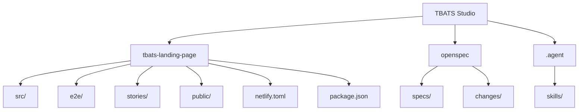

# TBATS Studio

**Crafting Digital Experiences That Convert**

> Premium agency website, interactive demo sandbox, and spec-driven development workspace.

[](https://tbats.dev)
[](https://www.typescriptlang.org)
[](https://react.dev)
[](https://github.com/ARareUsername/tbats-dev)
[](<>)

[Live Site](https://tbats.dev) · [App README](./tbats-landing-page/README.md) · [Contributing](./tbats-landing-page/CONTRIBUTING.md)

## Project Structure



## Features

- **Server-Side Rendering** — React Router 7 hybrid SSR/SPA for fast initial loads and SEO
- **Dark & Light Mode** — Theme-aware design system with seamless toggle
- **Rich Animations** — Framer Motion 12 powered micro-interactions and page transitions
- **Accessibility** — ARIA labels, keyboard navigation, screen reader support, skip links
- **Contact Form** — EmailJS-powered with client-side validation
- **Pricing Estimator** — Interactive project cost calculator with regional pricing

## Tech Stack

| Technology                                       | Purpose                                     |
| ------------------------------------------------ | ------------------------------------------- |
| [React 19](https://react.dev)                    | UI library                                  |
| [React Router 7](https://reactrouter.com)        | Hybrid SSR/SPA routing                      |
| [Vite 8](https://vite.dev)                       | Build tool and dev server                   |
| [TypeScript 5.6](https://www.typescriptlang.org) | Strict mode with `noUncheckedIndexedAccess` |
| [Framer Motion 12](https://motion.dev)           | Animation library                           |
| [Vitest](https://vitest.dev)                     | Unit and integration testing                |
| [Playwright](https://playwright.dev)             | End-to-end testing                          |
| [Storybook](https://storybook.js.org)            | Component development and documentation     |

## Quick Start

```bash
cd tbats-landing-page
npm install --legacy-peer-deps
npm run dev
```

The dev server starts at `http://localhost:5173`.

## Scripts

### Development

| Command             | Description                          |
| ------------------- | ------------------------------------ |
| `npm run dev`       | Start Vite dev server                |
| `npm run storybook` | Start Storybook on port 6006         |
| `npm run preview`   | Preview production build (port 4173) |

### Build

| Command                   | Description                               |
| ------------------------- | ----------------------------------------- |
| `npm run build`           | Production build to `dist/`               |
| `npm run build:analyze`   | Build with bundle analysis (`stats.html`) |
| `npm run build:storybook` | Build Storybook for deployment            |

### Test

| Command                 | Description                           |
| ----------------------- | ------------------------------------- |
| `npm run test`          | Run unit/integration tests (Vitest)   |
| `npm run test:watch`    | Run tests in watch mode               |
| `npm run test:coverage` | Tests with 80% coverage threshold     |
| `npm run test:e2e`      | E2E tests (Chromium, Firefox, WebKit) |

### Quality

| Command             | Description                               |
| ------------------- | ----------------------------------------- |
| `npm run typecheck` | TypeScript type checking (`tsc --noEmit`) |
| `npm run lint`      | ESLint (zero warnings required)           |
| `npm run lint:fix`  | ESLint auto-fix                           |
| `npm run format`    | Prettier formatting                       |

## Quality & Conventions

- **Conventional Commits** — commitlint enforces commit message format (feat, fix, docs, etc.)
- **Pre-commit Hooks** — Husky + lint-staged run ESLint and Prettier on staged files
- **ESLint Zero-Warnings** — CI fails on any warning or unused directive
- **TypeScript Strict** — Full strict mode with `noUncheckedIndexedAccess`, `exactOptionalPropertyTypes`, `noUnusedLocals`, `noUnusedParameters`
- **Test Coverage** — 80% minimum on statements, branches, functions, and lines
- **Lighthouse Budget** — Performance and accessibility thresholds enforced in CI

## Deployment

Deployed to **Netlify**. Build command: `npm run build`, publish directory: `dist/`. Security headers and redirects configured in `netlify.toml`.

## Contributing

See [CONTRIBUTING.md](./tbats-landing-page/CONTRIBUTING.md) for guidelines on development workflow, commit conventions, and pull request process.

## License

Private — All Rights Reserved.
