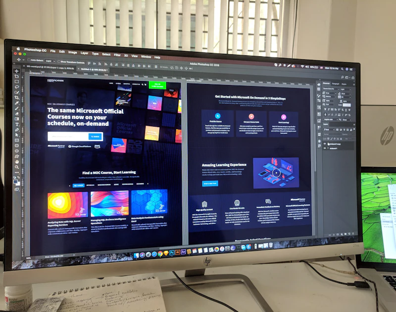

# TBATS Studio

**Pampanga Web Design Company — Affordable Websites That Bring You Customers**

> A premium web development studio based in Pampanga, Philippines. We design,
> build, and fully manage fast, modern websites for local businesses — no
> upfront fees, no tech jargon, just results.

[](https://tbats.dev)
[](https://www.typescriptlang.org)
[](https://react.dev)
[](<>)

**Live site:** [tbats.dev](https://tbats.dev) · **App docs:** [tbats-landing-page/README.md](./tbats-landing-page/README.md) · **Contributing:** [CONTRIBUTING.md](./tbats-landing-page/CONTRIBUTING.md)

---

## What We Build

TBATS is a real, production agency website — a showcase of the kind of work we
do for clients. Every section below is built from scratch (no templates) and
reflects our design and engineering standards.

| Section | What it shows |
| --- | --- |
| **Hero** | Pampanga-focused headline, ambient floating UI cards, and a plain-language pitch. |
| **Services** | Bento grid of offerings with a cursor spotlight and a "Pampanga, Philippines" chip. |
| **Project Gallery** | Real website placeholders, scroll-reveal cards, accessible imagery. |
| **Pricing** | Transparent monthly plans, no setup fees, info tooltips. |
| **Contact** | Google-style reviews block + a "Prefer to Text? We're Here" CTA. |
| **Final CTA** | Ambient dust + glow, availability pill, icon buttons. |

### Selected Work

A glimpse at the website concepts featured in the Project Gallery:

<p align="center">
  
  
  
</p>
<p align="center">
  
  
  
</p>

---

## Why It's Built This Way

- **Server-Side Rendering** — React Router hybrid SSR/SPA for fast loads and SEO.
- **Dark & Light Mode** — Theme-aware design system with a seamless toggle.
- **Rich Animations** — Framer Motion micro-interactions and scroll reveals.
- **Accessibility** — ARIA labels, keyboard navigation, skip links, reduced-motion support.
- **We Manage It** — hosting, updates, and support handled by us, so clients don't have to.

## Tech Stack

| Technology | Purpose |
| --- | --- |
| [React 19](https://react.dev) | UI library |
| [React Router 7](https://reactrouter.com) | Hybrid SSR/SPA routing |
| [Vite 8](https://vite.dev) | Build tool and dev server |
| [TypeScript 5.6](https://www.typescriptlang.org) | Strict mode |
| [Framer Motion 12](https://motion.dev) | Animation library |
| [Vitest](https://vitest.dev) | Unit & integration testing |
| [Playwright](https://playwright.dev) | End-to-end testing |
| [Storybook](https://storybook.js.org) | Component development |

---

## Run It Locally

```bash
cd tbats-landing-page
npm install --legacy-peer-deps
npm run dev          # http://localhost:5173
```

Other scripts:

| Command | Description |
| --- | --- |
| `npm run build` | Production build |
| `npm run preview` | Preview the production build (port 4173) |
| `npm run test` | Unit/integration tests (Vitest) |
| `npm run test:e2e` | End-to-end tests (Playwright) |
| `npm run lint` | ESLint (zero warnings required) |
| `npm run typecheck` | TypeScript type checking |
| `npm run storybook` | Component explorer (port 6006) |

See [tbats-landing-page/README.md](./tbats-landing-page/README.md) for the full
architecture, script reference, and deployment details.

---

## Deploy & Quality

- **Deployed** to Netlify — build `npm run build`, publish `dist/`, with strict
  CSP and security headers in `netlify.toml`.
- **Conventional Commits** enforced via commitlint + Husky pre-commit hooks.
- **CI** runs typecheck → lint (zero warnings) → test (80% coverage) → build →
  e2e → deploy.
- **Lighthouse** performance & accessibility budgets enforced in CI.

## License

Private — All Rights Reserved.
